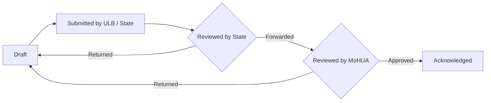

## 16th Finance Commission (XVI-FC) Module

This backend powers the digital reporting portal for India's **16th Finance Commission (XVI-FC)** grant program — the system State governments and Urban Local Bodies (ULBs) use to report, and the Ministry of Housing and Urban Affairs (MoHUA) uses to review, how XVI-FC grant money is received, held, and spent.

**Who's involved:**

| Role | What they do |
|---|---|
| **STATE** | Files state-level forms (SFC Status, Devolution Formula, Elected ULB Status, FC Unspent Declaration), reviews and final-submits ULB data on behalf of their state |
| **ULB** (Urban Local Body) | Submits its own forms — annual accounts, PFMS bank account details, unspent balance disclosures |
| **MoHUA** | Reviews and approves/returns state and ULB submissions at the national level |
| **PMU** | Programme monitoring and oversight roles with visibility across states |

**How a submission moves through the system:**



**What can be submitted through the portal:**

- **Annual Accounts** — ULBs upload audited/provisional financial statements, auto-validated via OCR.
- **Bank Account (PFMS) Details** — ULBs register the bank account that receives grant disbursements.
- **Unspent Balance Disclosure** — ULBs declare grant money carried over unspent from prior years.
- **SFC Status** — States report on their State Finance Commission constitution and recommendations.
- **Elected Urban Local Body Status** — States report the election/elected-body status of their ULBs.
- **Devolution Formula** — States report how grant funds are devolved to ULBs.
- **FC Unspent Declaration** — States declare unspent balances at the state level, reviewed row-by-row by MoHUA.
- **State Dashboard** — a state-wide, at-a-glance view of submission progress across all of the above.
- **Side Menu** — the configurable navigation shown to portal users, managed by admins.

See [XVI-FC Module Reference](#xvi-fc-module-reference) below for the technical breakdown.

## Project setup

```bash
$ npm install
```

## Compile and run the project

```bash
# development
$ npm run start

# watch mode
$ npm run start:dev

# production mode
$ npm run start:prod
```

## Run tests

```bash
# unit tests
$ npm run test

# e2e tests
$ npm run test:e2e

# test coverage
$ npm run test:cov
```

Optional: Format all files at once

```bash
npx prettier --write .
npx eslint . --fix
```

## XVI-FC Module Reference

Technical reference for `src/module/xvi-fc` — the codebase implementation of the [XVI-FC Module](#16th-finance-commission-xvi-fc-module) described above.

### Sub-module map

| Folder | Contains |
|---|---|
| `ulb/annual_accounts/` | ULB annual account uploads, OCR validation, status sync |
| `ulb/bank-account/` | ULB PFMS bank account submission, IFSC lookup, encryption/hashing utils |
| `ulb/unspent-balance-disclosure/` | ULB unspent balance disclosure CRUD + signed document URLs |
| `state/sfc-status/` | State SFC Status form (questions, draft, final-submit, Excel dump) |
| `state/elected-urban-local-bodies/` | State Elected ULB Status form — Excel ingest/validate, row edit, post-submission updates |
| `state/devolution-formula/` | State Devolution Formula form — Excel ingest/validate, row edit |
| `state/fc-unspent-declaration/` | State-side FC Unspent Declaration (draft, final-submit, ULB options) |
| `state/dashboard/` | State-level dashboard aggregating progress across all forms |
| `mohua/fc-unspent-declaration/` | MoHUA-side review of FC Unspent Declaration (bulk approve/reject, row review) |
| `side-menu/` | Admin CRUD for the portal's navigation menu |
| `cache/`, `common/` | Shared caching, form-actor resolution, file/folder-path normalization, validation helpers used across the sub-modules above |

### Controllers & routes

| Controller | Route prefix | Exposes |
|---|---|---|
| [`XviFcController`](src/module/xvi-fc/xvi-fc.controller.ts) | `xvi-fc` | state-wise data, cached side menu, years, ULB/state lookup, form-status, cache admin |
| [`SideMenuController`](src/module/xvi-fc/side-menu/side-menu.controller.ts) | `xvi-fc/side-menu` | admin CRUD, bulk-create, toggle-active for side menu items |
| [`FcUnspentMohuaReviewController`](src/module/xvi-fc/mohua/fc-unspent-declaration/fc-unspent-mohua-review.controller.ts) | `xvi-fc/mohua/fc-unspent-declaration` | bulk row approve/reject, paginated rows, whole-form approve/reject |
| [`StateDashboardController`](src/module/xvi-fc/state/dashboard/state-dashboard.controller.ts) | `xvi-fc/state` | `GET :stateId/:yearId/dashboard` |
| [`UnspentBalanceDisclosureController`](src/module/xvi-fc/ulb/unspent-balance-disclosure/unspent-balance-disclosure.controller.ts) | `xvi-fc/unspent-balance-disclosure` | create/get/update disclosure, signed document URL |
| [`FcUnspentDeclarationController`](src/module/xvi-fc/state/fc-unspent-declaration/fc-unspent-declaration.controller.ts) | `xvi-fc/state/fc-unspent-declaration` | save-draft, final-submit, hydrated form fetch, ULB options, template download |
| [`SfcStatusController`](src/module/xvi-fc/state/sfc-status/sfc-status.controller.ts) | `xvi-fc/state/sfc-status` | questions, Excel dump, hydrated form, save-draft, final-submit |
| [`AnnualAccountsController`](src/module/xvi-fc/ulb/annual_accounts/annual_accounts.controller.ts) | `xvi-fc/annual-account` | confirm-upload (triggers OCR queue), upload-config, by-ULB lookup, submit, retry/delete doc |
| [`BankAccountController`](src/module/xvi-fc/ulb/bank-account/bank-account.controller.ts) | `xvi-fc/bank-account` | IFSC lookup, get/submit bank account |
| [`ElectedUrbanLocalBodiesController`](src/module/xvi-fc/state/elected-urban-local-bodies/controllers/elected-urban-local-bodies.controller.ts) | `xvi-fc/state/elected-urban-local-bodies` | questions, save-draft, validate/revalidate Excel, final-submit, template/error-sheet/dump downloads, row patch, post-submission-update flow |
| [`DevolutionFormulaController`](src/module/xvi-fc/state/devolution-formula/devolution-formula.controller.ts) | `xvi-fc/state/devolution-formula` | dump, save-draft, validate-excel, final-submit, template/error-sheet downloads, row patch, revalidate-excel |

### Async processing

[`AnnualAccountOcrProcessor`](src/module/xvi-fc/ulb/annual_accounts/annual-account-ocr.processor.ts) consumes the `ANNUAL_ACCOUNT_PROCESSING_QUEUE` BullMQ queue (`src/core/constants/queues.ts`): it downloads an uploaded annual-account PDF from S3, submits it to the OCR API, polls for the result, and writes the OCR/validation outcome back onto the `XviFcAnnualAccount` document and its upload history.

### Data model

Schemas live under `src/schemas/xvi-fc/`:

- `annual-account.schema.ts` / `annual-account-upload-history.schema.ts` / `annual-account-processing-jobs.schema.ts` — ULB annual account submissions, per-upload history, and OCR job tracking
- `grant-allocation.schema.ts` — per-state/year grant allocation amounts
- `unspent-balance-disclosure.schema.ts` — ULB unspent balance disclosure
- `ulb/xvi-fc-bank-account.schema.ts` — ULB bank account + proof file
- `state/devolution-formula-form.schema.ts` / `-row.schema.ts` — Devolution Formula form + row data
- `state/elected-urban-local-bodies-form.schema.ts` / `-row.schema.ts` — Elected ULB Status form + row data
- `state/fc-unspent-state-form.schema.ts` / `-row.schema.ts` / `-history.schema.ts` / `-row-history.schema.ts` — state FC Unspent Declaration form, rows, and audit history
- `state/sfc-status.schema.ts` / `-history.schema.ts` — SFC Status form + history

### Caching

[`XviFcCacheService`](src/module/xvi-fc/cache/xvi-fc-cache.service.ts) wraps the shared `RedisService` for JSON get/set/delete. [`XviFcCacheInterceptor`](src/module/xvi-fc/cache/xvi-fc-cache.interceptor.ts) caches whole route responses keyed by request URL, with per-handler TTL via the `@XviFcCacheTTL(seconds)` decorator (default 600s); cache can be cleared via the admin cache endpoints on `XviFcController`.

### Configuration

xvi-fc-specific environment variables, in addition to the ones the rest of the app requires:

| Variable | Purpose |
|---|---|
| `BANK_ACCOUNT_ENCRYPTION_KEY` | Encrypts ULB bank account details at rest (`ulb/bank-account`) |
| `BANK_ACCOUNT_HASH_SECRET` | HMAC secret for ULB bank account integrity hashing (`ulb/bank-account`) |
| `MANUAL_REVIEW_NOTIFY_EMAIL` | Fixed inbox emailed when a ULB requests manual review of a failed OCR validation (`ulb/annual_accounts`) |

### Roles & access

xvi-fc-relevant roles from `src/module/auth/enum/role.enum.ts`:

| Role | Access |
|---|---|
| `STATE` | Full access to state-level forms; reviews/final-submits ULB data for their state |
| `ULB` | Full access to ULB-level forms for their own ULB |
| `MoHUA` | National-level review/approval across states |
| `PMU` | Programme monitoring, cross-state visibility |
| `STATE-EDITOR` / `STATE-VIEWER` | Sub-roles for a state team — edit-and-submit vs. read-only |

### Testing

33 spec files cover `src/module/xvi-fc`, with the deepest coverage on the most complex form workflows: Devolution Formula, State Dashboard, Elected Urban Local Bodies (including post-submission updates), and FC Unspent Declaration.
